<!--
GitHub profile README for Sha-Lai Berends.
No employer names, client names, branch/location names, private operational data or secrets are included.
-->

# Sha-Lai Berends

### Business Automation & Data Operations Builder

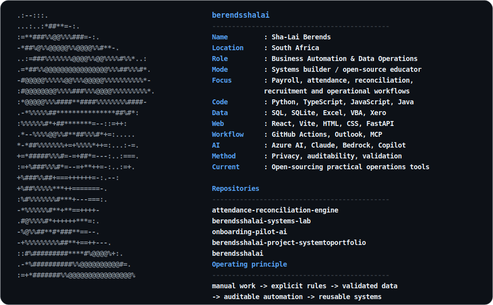

## Live GitHub statistics

<!-- LIVE_STATS_IMAGE_START -->

  

<!-- LIVE_STATS_IMAGE_END -->

Updated automatically from the GitHub API. Contributions and commits cover the trailing 365 days. Source lines are an estimate of currently tracked source-code lines across owned, public, non-fork repositories; generated files, dependencies, binaries and documentation are excluded.

## Profile

  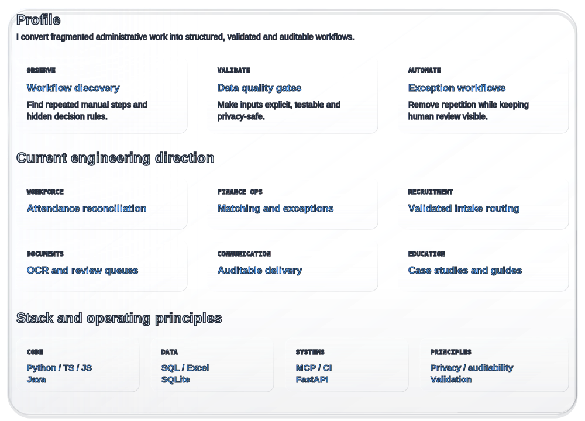

## Selected repositories

  <a href="https://github.com/berendsshalai/onboarding-pilot-ai">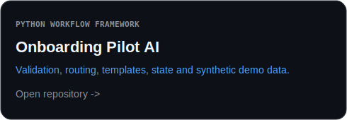</a>
  <a href="https://github.com/berendsshalai/berendsshalai-project-systemtoportfolio">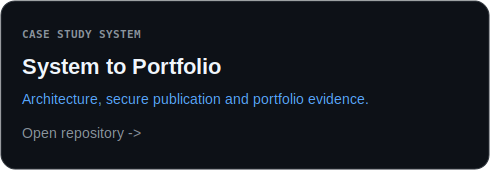</a>
  
  <a href="https://github.com/berendsshalai/berendsshalai-systems-lab">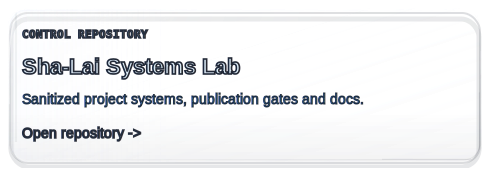</a>

## Contact

  <a href="https://github.com/berendsshalai">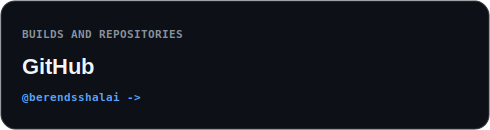</a>
  <a href="https://www.linkedin.com/in/sha-lai-berends">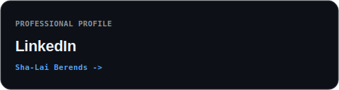</a>
  <a href="https://x.com/berendsshalai">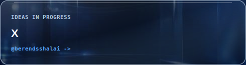</a>
  
  <a href="https://www.instagram.com/berendsshalai">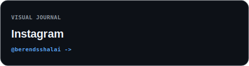</a>
  
  <a href="https://sha-lai-be-2a6c6108-shalaiberends.wix-site-host.com">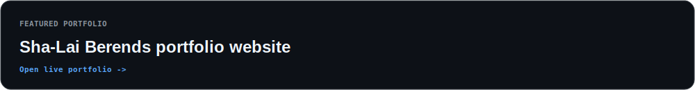</a>

## Publication boundary

  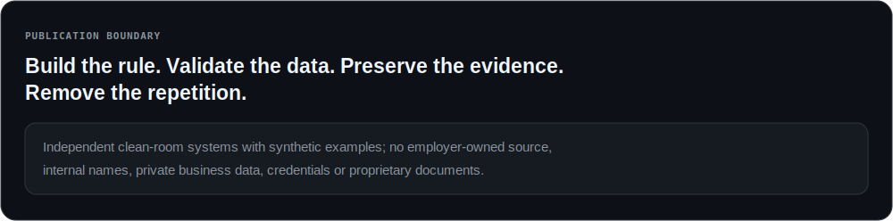

